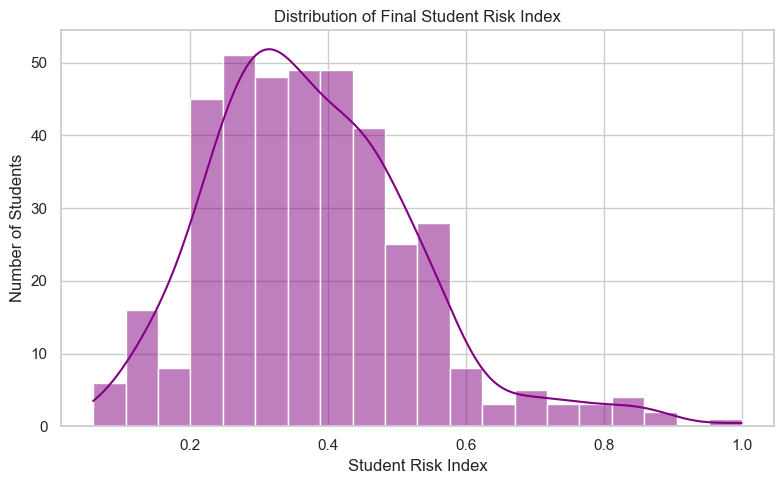
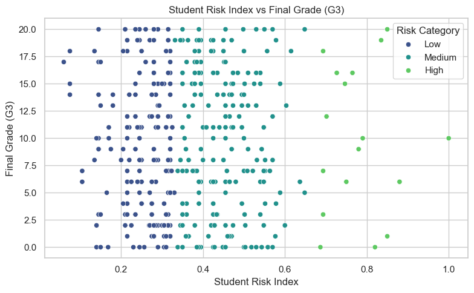
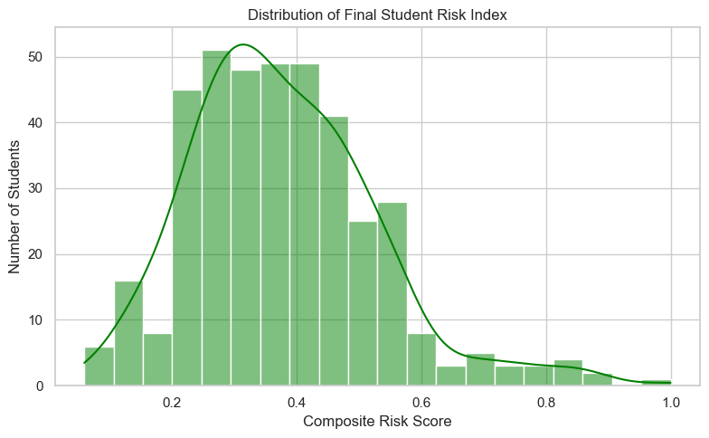
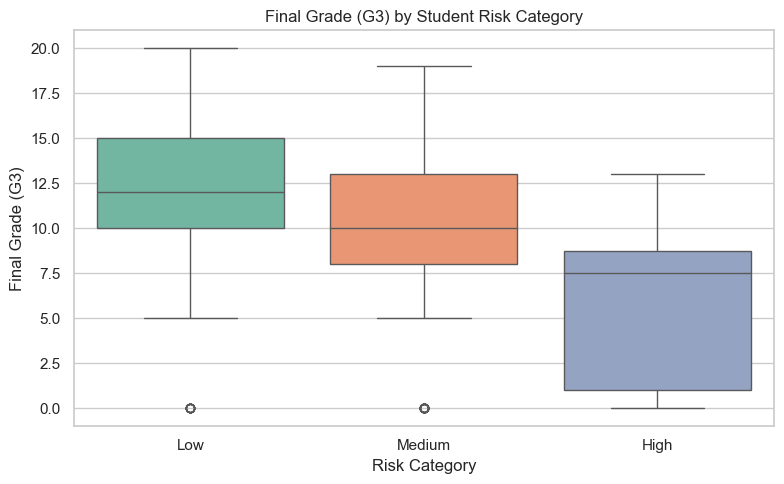
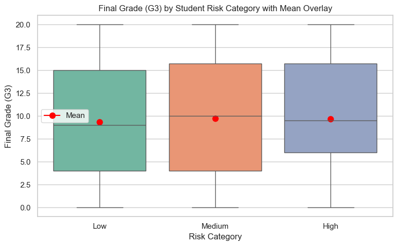
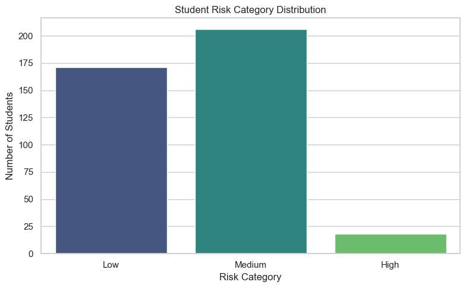
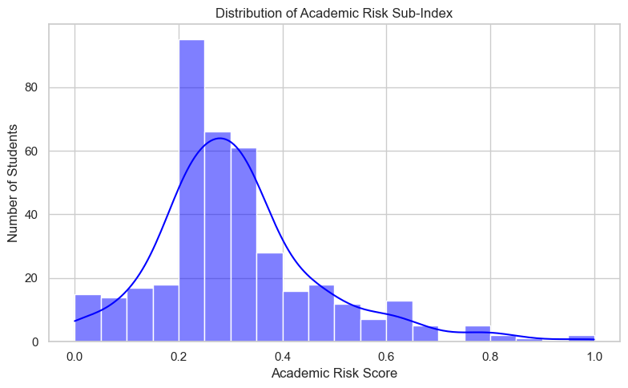
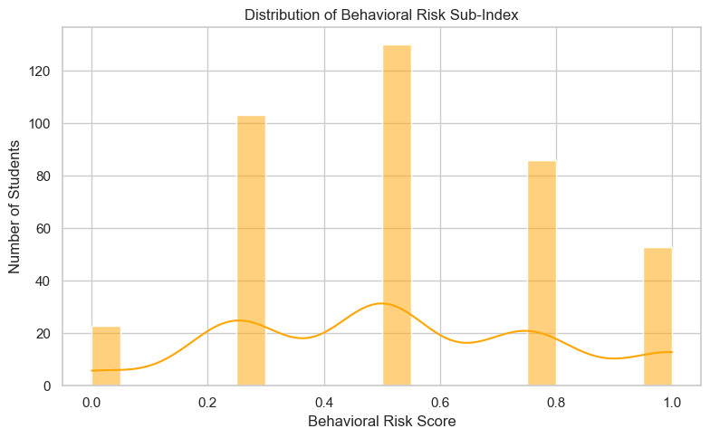
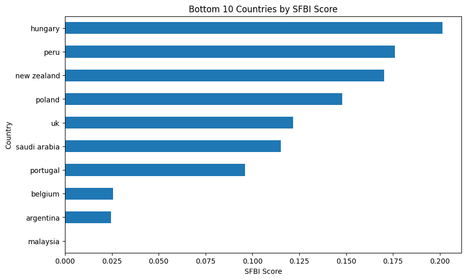

Documentation for the Index

1.Data Selection

The dataset used originates from the UCI Student Performance dataset, which includes various academic and socio-demographic factors collected from Portuguese secondary schools. Relevant variables were selected to reflect personal, academic, and familial influences on performance.

2. Missing Data Imputation
A thorough check for missing values was conducted. The dataset was largely complete, and where applicable, simple imputation (mean or mode replacement) was used.

3. Multivariate Analysis

Correlation matrices and pair plots were used to identify the most relevant variables for inclusion. Strong correlations were found between final grades and factors such as study time, failures, and parental education. We excluded low-impact variables to improve model clarity.

4. Normalisation

To ensure fair comparison across metrics, min-max normalization was applied to all variables. This scaled the values between 0 and 1, making them suitable for weighted aggregation.

5. Weighting and Aggregation

Each variable was assigned a weight based on its correlation with final performance. Variables with stronger influence (e.g., failures, study time) received higher weights. The weighted scores were aggregated into a final composite score representing the student's overall risk level.

6. Visualisation of Results

6. Visualisation of Results

Visual tools were employed to enhance interpretation:

- **Heatmaps** showed correlations between variables.
- **Bar Charts** displayed individual student risk scores.
- **Scatter Plots** were used to explore relationships between grades and risk.
- **Category Distributions** helped identify trends by groupings such as school support or family background.

7. Link to Other Indices

Several indices were reviewed:

Student Default Risk Index (SDRI): Focuses on financial accountability, not academic risk.

Student Aid Index (SAI): Measures financial eligibility, partially related.

SUSI Eligibility Indicator (Ireland): Similar in socio-economic focus.

Adolescent Mental Health Study: Closest match, focused on psychological factors.

A table was created to compare these indices against the SRI based on focus, data type, and similarity.